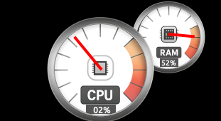

## CPU & RAM Analog Gauge for Conky

A Windows 7–style analog gauge widget for **Conky** that shows live CPU and RAM usage using a Cairo-rendered dial. The widget ships with ready-to-use configuration and artwork files so you can drop it into your Conky setup quickly.



### What’s included

- `conky.conf` – Minimal Conky configuration that loads the gauge Lua script and positions the widget.
- `gauge.lua` – Cairo drawing logic for the dial, needles, and labels.
- `gauge.png` – Background image containing both dials (CPU on the left, RAM on the right).
- `conky.conf.png` – Reference screenshot of the widget on a desktop.

### Prerequisites

- Conky with Lua (Cairo) support installed on your system.
- `cairo` Lua module available to Conky (typically included with Conky’s Lua support packages).

### Installation

1. **Copy the repository files** into your Conky configuration directory:
   ```bash
   mkdir -p ~/.conky/cpu-gauge-analog
   cp conky.conf gauge.lua gauge.png ~/.conky/cpu-gauge-analog/
   ```

2. **Adjust image path if needed:** The `IMG_PATH` constant near the top of `gauge.lua` points to the expected location of `gauge.png`:
   ```lua
   local IMG_PATH = "/home/Reneto/.conky/cpu-gauge-analog/gauge.png"
   ```
   Update the path to match your username and desired folder (e.g., `/home/<user>/.conky/cpu-gauge-analog/gauge.png`).

3. **Launch Conky with this config:**
   ```bash
   conky -c ~/.conky/cpu-gauge-analog/conky.conf
   ```

### Customization tips

- **Positioning:** Tweak `alignment`, `gap_x`, and `gap_y` in `conky.conf` to position the widget on your screen.
- **Window behavior:** `own_window_type = 'dock'` and `own_window_transparent = true` give a floating, borderless look. Adjust these options if you prefer a different embedding style.
- **Dial angles:** If you replace `gauge.png` with your own artwork, the `MIN_ANGLE_DEG` and `MAX_ANGLE_DEG` constants in `gauge.lua` control needle calibration for the dial.

### License

Released under the MIT License. See [LICENSE](LICENSE) for details.
